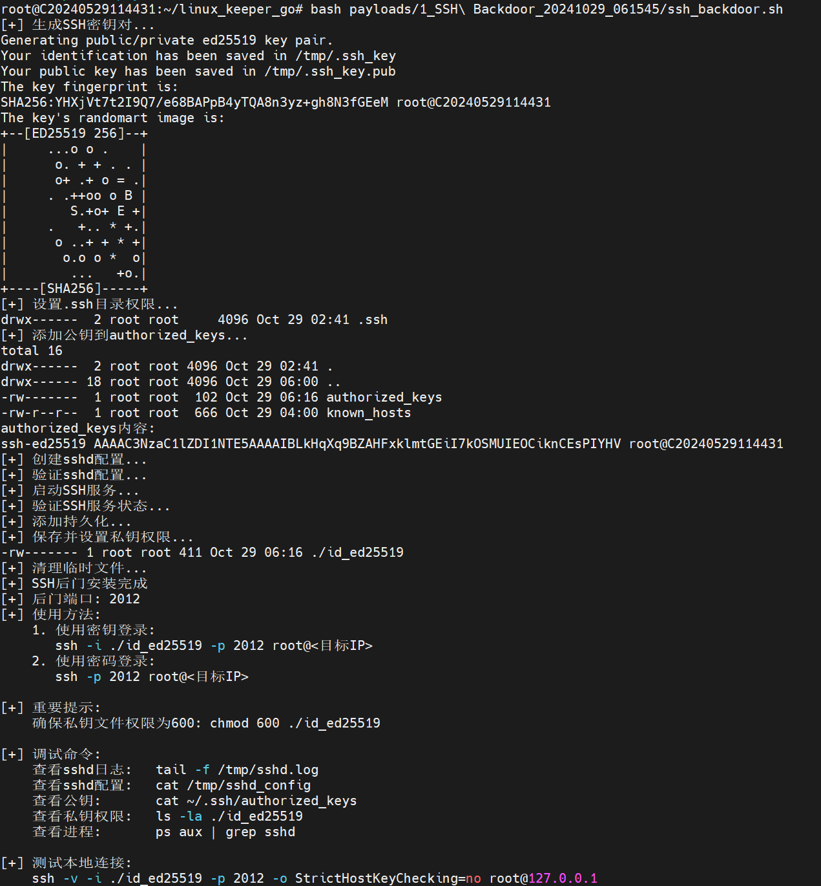

# LinuxKeeperGo

Advanced 
Linux Persistence Tool written in Go.

## Features

- System environment detection
- Multiple persistence methods
- Automated payload generation
- Support for various Linux distributions

## Installation

```bash
git clone https://github.com/10cks/LinuxKeeperGo
cd LinuxKeeperGo
CGO_ENABLED=0 GOOS=linux GOARCH=amd64 go build -a -trimpath -ldflags '-w -s -extldflags "-static"' -o LinuxKeeperGo ./cmd/main.go
```

## Usage

```bash
    _     _                  _  __                         ____
   | |   (_)_ __  _   ___  _| |/ /___  ___ _ __   ___ _ / ___| ___
   | |   | | '_ \| | | \ \/ / ' // _ \/ _ \ '_ \ / _ \ | |  _ / _ \
   | |___| | | | | |_| |>  <| . \  __/  __/ |_) |  __/ | |_| | (_) |
   |_____|_|_| |_|\__,_/_/\_\_|\_\___|\___| .__/ \___|  \____|\___/
                                          |_|

    [*] Linux Persistence Tool - Written in Go
    [*] Author: 10cks
    [*] Github: https://github.com/10cks/LinuxKeeperGo
    [*] Version: 1.0.0

[*] System Check Results:
---------------->Privilege<-----------------
uid=1000(ubuntu) gid=1000(ubuntu) groups=1000(ubuntu),4(adm),20(dialout),24(cdrom),25(floppy),27(sudo),29(audio),30(dip),44(video),46(plugdev),116(netdev),1001(docker)
----------->Backdoor Check<-------------
OpenSSH后门[只测试过 Ubuntu 14 版本成功]
[x] SSH后门用户
[√] Alerts后门
计划任务后门
  [x] /etc/crontab
  [√] /var/spool/cron/ubuntu
  [√] /var/spool/cron/crontabs
[x] SSH软链接后门
  [如果是root权限，可以直接SSH软链接模块运行开启]
[√] SSH公私密钥后门
   没有权限修改sshd_config文件
[√] Strace后门
[x] Rootkit后门
计划任务&SSH软链接后门
  [x] /etc/crontab
  [√] /var/spool/cron/ubuntu
  [√] /var/spool/cron/crontabs
计划任务&SSH Key后门
  [x] /etc/crontab
  [√] /var/spool/cron/ubuntu
  [√] /var/spool/cron/crontabs
  [x] /etc/ssh/sshd_config
------------------->Env<--------------------
[x] PHP
[x] Kubernetes
[x] Rust
[√] C++
[x] Python2
[√] Python3
[x] Java
[√] Docker


Usage:
  -m <number>  Select and execute a module
  -c <1|2>    Show module information
  -l          List all available modules
  -h          Show this help message
```

## Current Modules

[1] [root] SSH Backdoor - Create SSH backdoor with custom port

[2] [user/root] Crontab Backdoor - Create persistent crontab backdoor

## Demo

### ssh module



## 参考项目：

https://github.com/RuoJi6/HackerPermKeeper